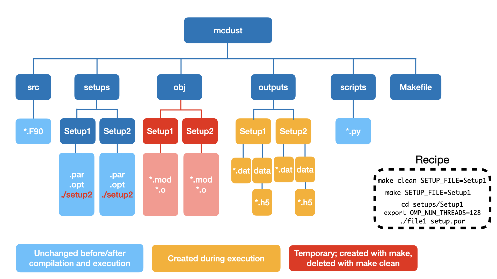

Code setup
==========

:code:`mcdust` architecture
+++++++++++++++++++

Workflow of :code:`mcdust`
+++++++++++++++++
The workflow of the code is as shown below.

Depending on the input parameters for the disk setup, the swarms of dust will be setup and advection and collisions will be performed for the swarms.

